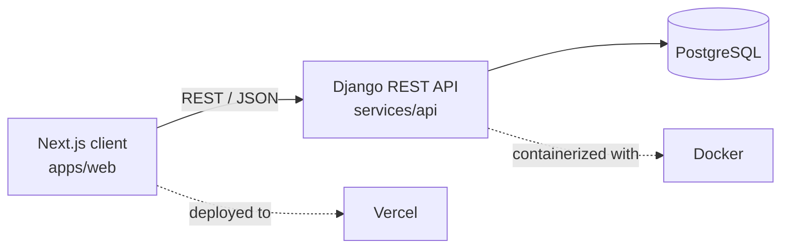

<div align="center">

# Lumine

**Described by its author as a "modeling app" — a Persian-first platform for creating, showcasing, and collaborating on projects.**


</div>

---

## Table of contents

- [About](#about)
- [Features](#features)
- [Tech stack](#tech-stack)
- [Architecture](#architecture)
- [Getting started](#getting-started)
- [Environment variables](#environment-variables)
- [Available scripts](#available-scripts)
- [Roadmap](#roadmap)
- [Contributing](#contributing)
- [Security](#security)
- [License](#license)
- [Acknowledgments](#acknowledgments)

## About

Lumine is a full-stack, Persian-first (Farsi, RTL) web application built around **projects**: users create, publish, search, and share project-based work, bookmark the projects they care about, and collaborate with others. It ships with an account and notification system, Jalali (Persian) calendar support, and province-level data for the Iranian market.

The codebase is organized as two independently run applications in a single repository:

| Path                             | Description                                |
| -------------------------------- | ------------------------------------------ |
| [`apps/web`](./apps/web)         | Next.js (App Router) + TypeScript frontend |
| [`services/api`](./services/api) | Django + Django REST Framework backend     |

> **Note:** the paragraph above was reconstructed from the codebase, commit history, and open issues rather than an existing product brief. Refine it if it doesn't match your intended positioning.

## Features

- **Projects** — create, search, and browse projects, each with a start/end date, a detail page, share and bookmark actions, and multi-user collaboration
- **Notifications** — a filterable (all / unread / read) notification center with a per-notification detail view
- **Profiles** — user profile pages with account info
- **Jalali calendar support** — Persian date picker for date-based fields
- **Iran-specific localization** — all 31 provinces seeded via a Django management command
- **Dark mode** and a fully **RTL** layout
- **Localized Django Admin** — RTL styling and Persian date widgets for internal/staff use
- **Dockerized API** for a consistent local and production environment

## Tech stack

### Frontend — `apps/web`

| Category                     | Technology           |
| ---------------------------- | -------------------- |
| Framework                    | Next.js (App Router) |
| Language                     | TypeScript           |
| Styling                      | Tailwind CSS         |
| UI components                | HeroUI               |
| Icons                        | Gravity UI Icons     |
| Server state / data fetching | TanStack Query       |
| Deployment target            | Vercel               |

### Backend — `services/api`

| Category         | Technology            |
| ---------------- | --------------------- |
| Framework        | Django 5.2            |
| API layer        | Django REST Framework |
| Database         | PostgreSQL            |
| Language         | Python 3.13           |
| Dev tooling      | django-extensions     |
| Containerization | Docker                |

### Tooling

| Category       | Technology     |
| -------------- | -------------- |
| CI             | GitHub Actions |
| Source control | Git / GitHub   |

## Architecture

```
lumine/
├── apps/
│   └── web/                         # Next.js frontend
│       ├── app/
│       │   └── (main)/
│       │       ├── projects/
│       │       │   └── page.tsx
│       │       └── notifications/
│       │           ├── page.tsx
│       │           └── [notificationRecipientId]/
│       │               └── page.tsx
│       └── features/
│           ├── projects/
│           │   ├── components/
│           │   └── services/
│           └── notifications/
│               ├── components/
│               ├── lib/
│               └── types/
├── services/
│   └── api/                         # Django backend
│       ├── config/                  # settings.py, urls.py, wsgi/asgi
│       ├── apps/
│       │   └── authentication/
│       │       └── management/commands/
│       ├── manage.py
│       ├── requirements.txt
│       └── Dockerfile
└── .github/
    └── workflows/
```

The frontend follows a **feature-based architecture**: routing lives under `app/`, while each domain (`projects`, `notifications`, …) owns its `components/`, `services/` (API calls), `lib/` (adapters/mappers), and `types/` under `features/`. The backend follows Django's conventional `config` + `apps` split, with each domain implemented as its own Django app.



## Getting started

### Prerequisites

- Node.js 18+ (CI is run against 18.x, 20.x, and 22.x)
- Python 3.13
- PostgreSQL (or Docker — see below)
- npm (or your package manager of choice)

### 1. Clone the repository

```bash
git clone https://github.com/Amirali-Allahverdi/lumine.git
cd lumine
```

### 2. Frontend — `apps/web`

```bash
cd apps/web
npm install
npm run dev
```

The app runs at `http://localhost:3000` by default.

### 3. Backend — `services/api`

```bash
cd services/api
python -m venv venv
source venv/bin/activate        # Windows: venv\Scripts\activate
pip install -r requirements.txt
python manage.py migrate
python manage.py load_provinces # seeds Iranian province data
python manage.py runserver
```

The API runs at `http://localhost:8000` by default.

#### Or, with Docker

```bash
cd services
docker compose up --build
```

This provisions the API alongside a PostgreSQL service.

## Environment variables

Create a git-ignored `.env` file at `services/api/.env`. **Never commit real values** — see [Security](#security).

| Variable            | Description                                    |
| ------------------- | ---------------------------------------------- |
| `SECRET_KEY`        | Django secret key                              |
| `DEBUG`             | `True` / `False`                               |
| `ALLOWED_HOSTS`     | Comma-separated list of allowed hosts          |
| `POSTGRES_DB`       | Database name                                  |
| `POSTGRES_USER`     | Database user                                  |
| `POSTGRES_PASSWORD` | Database password                              |
| `POSTGRES_HOST`     | Database host (`db` when using Docker Compose) |
| `POSTGRES_PORT`     | Database port (default `5432`)                 |

## Available scripts

**Frontend (`apps/web`)**

| Command         | Description                  |
| --------------- | ---------------------------- |
| `npm run dev`   | Start the Next.js dev server |
| `npm run build` | Create a production build    |
| `npm run start` | Serve the production build   |
| `npm run lint`  | Lint the codebase            |

**Backend (`services/api`)**

| Command                            | Description                 |
| ---------------------------------- | --------------------------- |
| `python manage.py runserver`       | Start the Django dev server |
| `python manage.py migrate`         | Apply database migrations   |
| `python manage.py createsuperuser` | Create a Django admin user  |
| `python manage.py load_provinces`  | Seed Iranian province data  |

## Roadmap

Tracked in [Issues](https://github.com/Amirali-Allahverdi/lumine/issues):

- [ ] Validate that a project's end date can't precede its start date
- [ ] Live/real-time toast notifications
- [ ] Persian date picker refinements
- [ ] Pagination fixes across list views
- [ ] Automated test coverage for both `apps/web` and `services/api`
- [ ] CI pipeline scoped to each workspace (build, lint, and test `apps/web` and `services/api` independently)

## Contributing

1. Fork the repository
2. Create a feature branch: `git checkout -b feature/your-feature`
3. Commit your changes
4. Open a pull request against `main`

## Security

If you discover a security vulnerability, please report it privately rather than opening a public issue. Never commit real secrets — API keys, database credentials, or `SECRET_KEY` values — to the repository; keep them in a git-ignored `.env` file and read them via environment variables, as `services/api/config/settings.py` already does for most settings.

## License

No license has been published for this repository yet. Until one is added, all rights are reserved by the author.

## Acknowledgments

Built by [Amirali Allahverdi](https://github.com/Amirali-Allahverdi), with contributions from [MeruOnin](https://github.com/MeruOnin).
